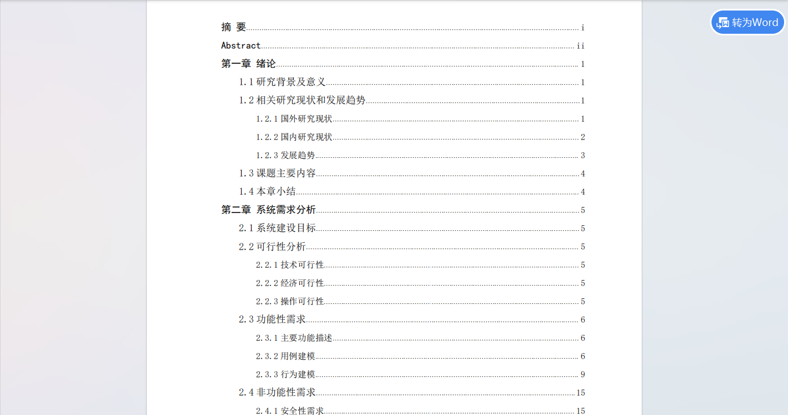
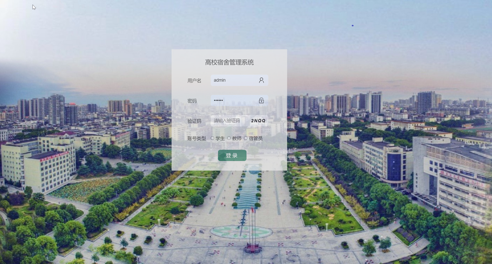
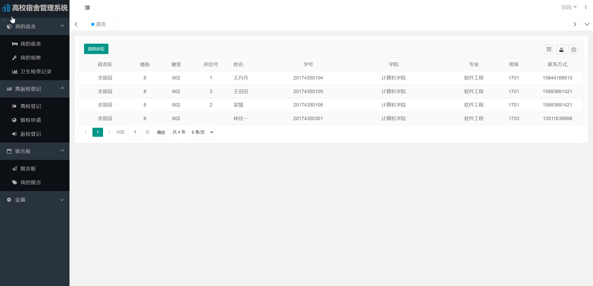
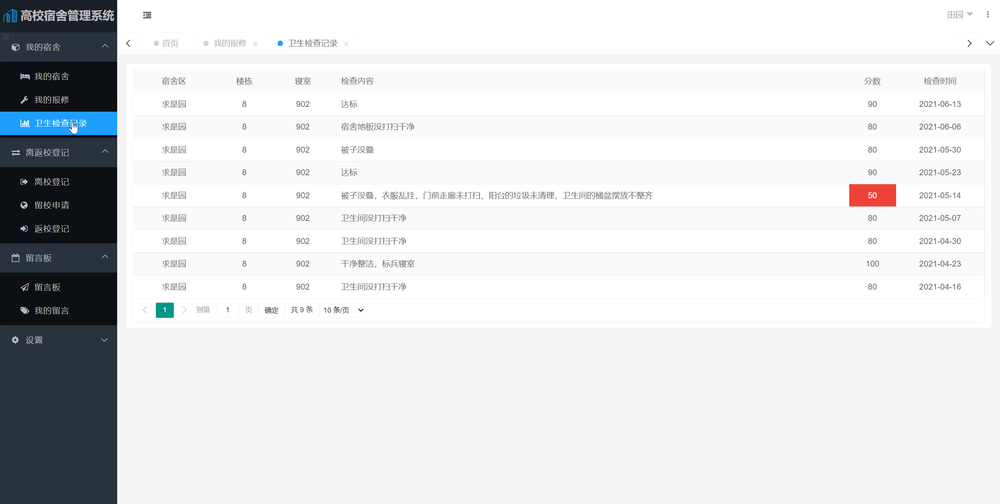
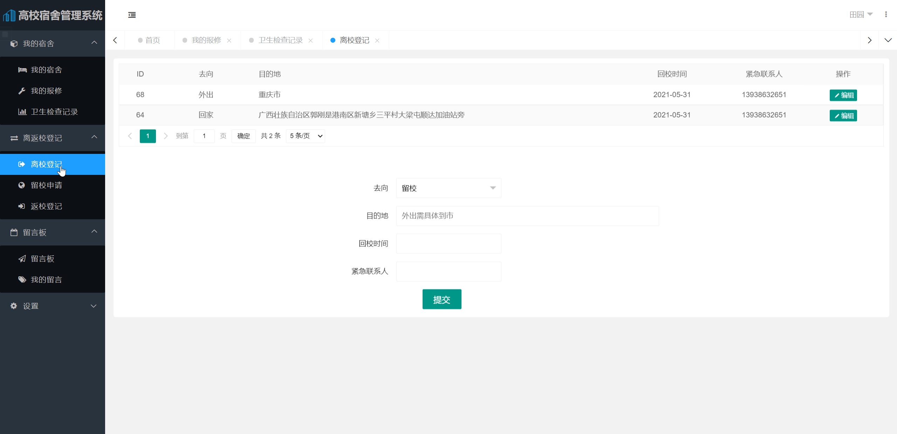
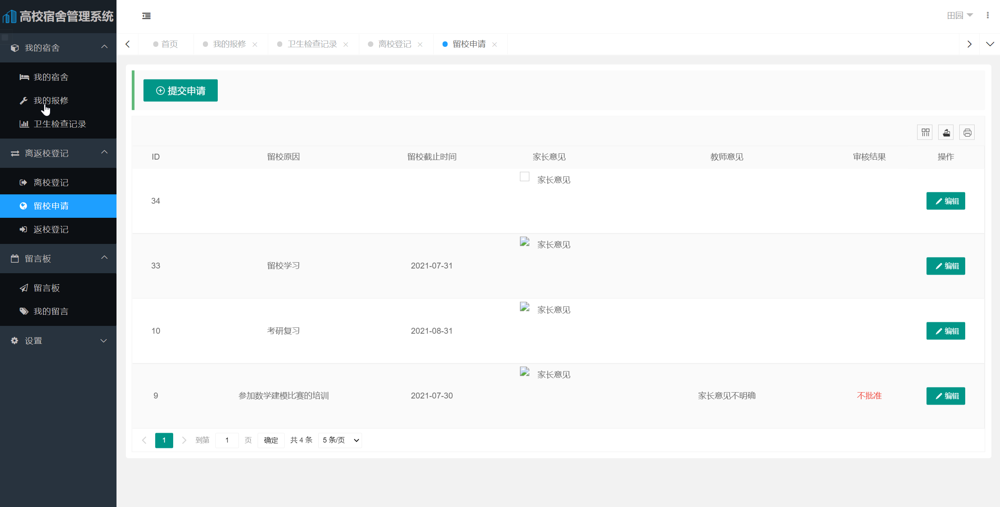
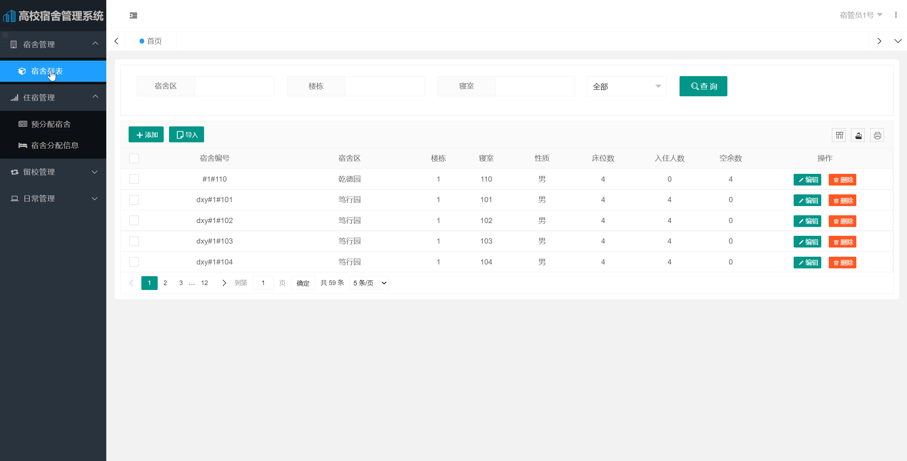

基于Springboot的高校宿舍管理系统（程序+论文）
=
### 完整代码获取地址：从戎源码网 ([https://armycodes.com/](https://armycodes.com/))
### 作者微信：19941326836  QQ：952045282 
### 承接计算机毕业设计、Java毕业设计、Python毕业设计、深度学习、机器学习
### 选题+开题报告+任务书+程序定制+安装调试+论文+答辩ppt 一条龙服务
### 所有选题地址https://github.com/nature924/allProject

一、项目介绍
---
基于SpringBoot框架的实现的高校宿舍管理系统，本系统共分为2个角色：系统管理员、用户，主要功能如下

### （1）基本信息管理

基本信息分为学生信息和宿舍信息两部分，其功能是负责维护这些信息，对

它们进行增删查改等操作。

### （2）宿舍分配管理

根据给定的宿舍信息与学生信息，按照一定的规则自动地给还未分配宿舍的

学生分配宿舍，学生可在该宿舍内自选床位，最终的宿舍分配信息可以以文件形

式（如 Excel 表格）导出。

### （3）宿舍日常管理

主要包括卫生管理、报修管理、留言管理等。

卫生管理：记录并维护卫生检查信息。

报修管理：添加、查看、修改报修单信息。

留言管理：包括发布公告、失物招领、普通留言以及对这些信息的维护。

### （4）离返校管理

对节假日学生的去向、寒暑假学生的留校以及返校登记信息进行统计及管

理，并以图表形式呈现统计信息。

### （5）综合查询管理

包括查找学生信息、各楼栋/专业的学生宿舍分配情况、卫生检查情况、学

生离返校及留校信息、指定类型的留言、查看宿舍成员等。 

二、项目技术
---
- 编程语言：Java
- 数据库：MySQL
- 项目管理工具：Maven
- 前端技术：VUE、HTML、Jquery、Bootstrap
- 后端技术：Spring、SpringMVC、MyBatis

三、运行环境
---
- 操作系统：Windows、macOS都可以
- JDK版本：JDK1.8以上都可以
- 开发工具：IDEA、Ecplise、Myecplise都可以
- 数据库: MySQL5.7以上都可以
- Tomcat：任意版本都可以
- Maven：任意版本都可以

四、运行截图
---
### 论文截图：

### 程序截图：

